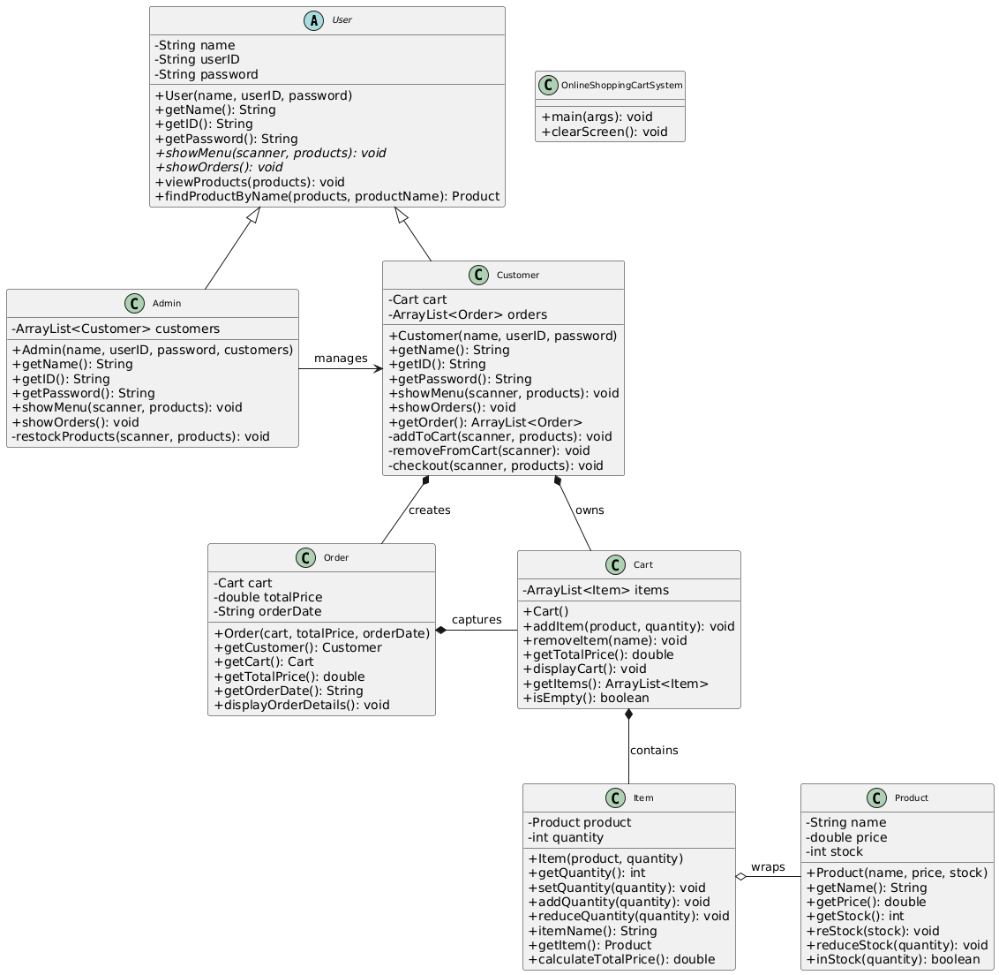

# Online Shopping Cart System
This project is a simple online shopping cart system built using Java. It allows users to browse products, add them to their cart, and manage their orders.

## Group Members
1. [Iman Abadi Bin Mohd Nizwan](https://github.com/imn353) (A23CS0084)
2. [Mohamed Alif Fathi Bin Abdul Latif](https://github.com/AlifFathi) (A23CS0112)

## Class Diagram

  

